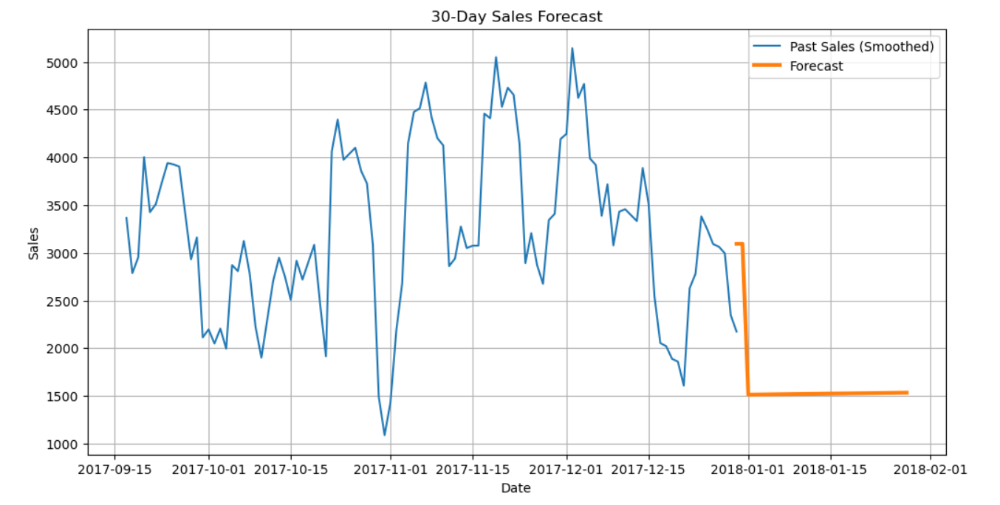

# 📊 Sales Forecasting using Machine Learning

## 🔍 Introduction
This project focuses on predicting future sales based on historical data using Machine Learning.

Sales forecasting is important because it helps businesses:
* Plan inventory efficiently  
* Avoid overstock or understock  
* Understand demand trends  
* Make better business decisions  

---

## 🧹 Data Cleaning
* Handled missing values  
* Converted date column into proper datetime format  
* Ensured data consistency for modeling  

---

## ⚙️ Feature Engineering
Extracted useful features from date:
* Year  
* Month  
* Day  
* Day of Week  

These features help the model understand time-based patterns.

---

## 🤖 Model Building
* Model Used: **Linear Regression**  
* The model learns the relationship between time features and sales  

---

## 📉 Model Evaluation
- **Mean Absolute Error (MAE): 1464.93**

👉 This means:
> On average, the model's prediction is off by approximately **1465 units**

---

## 📈 Visualization

### Actual vs Predicted Sales
- Blue Line → Actual Sales  
- Orange Line → Predicted Sales  

---

## 📊 Output
* Generated **30-day future sales forecast**
* Stored results in `future_sales.csv`

---

## 💼 Business Insights
* Sales show fluctuations with sudden spikes  
* Forecast indicates a relatively stable trend  
* Businesses can:
  - Plan inventory more effectively  
  - Reduce losses due to overstocking  
  - Prepare for demand variations  

---

## 🛠️ Tools & Technologies
* Python  
* Pandas  
* NumPy  
* Matplotlib  
* Scikit-learn  

---

## 🚀 Conclusion
This project demonstrates how Machine Learning can be used to analyze past data and make meaningful predictions for future sales, helping businesses make data-driven decisions.
